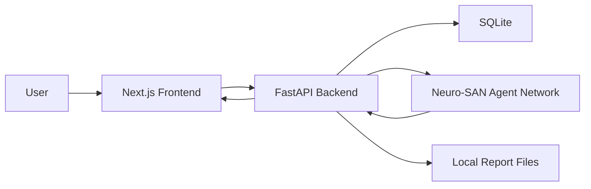

# CompliQ Architecture

## 1. System Overview

CompliQ is a three-layer architecture with persistent storage:
1. Frontend (Next.js) for user interaction and demo storytelling.
2. Backend (FastAPI) for ingestion, orchestration, persistence, and API serving.
3. Agent Layer (Neuro-SAN) for structured compliance reasoning.
4. SQLite storage for documents, runs, findings, tasks, and report references.

## 2. Architectural Goals

- Keep deployment simple for hackathon constraints.
- Preserve deterministic reliability for demos.
- Keep contracts stable while allowing agent intelligence upgrades.
- Produce explainable business outputs, not opaque scores.

## 3. Component View

## 4. Request-to-Result Flow

### 4.1 Document Upload

1. User uploads file via dashboard.
2. Frontend sends multipart request to backend.
3. Backend stores file and extracted text preview.
4. Backend persists `Document` row in SQLite.
5. Frontend refreshes document list.

### 4.2 Analysis Execution

1. User selects one or more document IDs.
2. Frontend calls `POST /api/v1/analysis/run`.
3. Backend loads selected documents and merges text.
4. Backend invokes analysis service:
- Neuro-SAN first (if enabled)
- Deterministic heuristic fallback on failure
5. Backend persists:
- `AnalysisRun`
- `Finding[]`
- `TaskItem[]`
- `Report`
6. Backend returns summary payload.
7. Frontend fetches details and report content.

## 5. Data Flow and Ownership

Data ownership boundaries:
- Frontend: transient UI state and rendering.
- Backend: business logic and contract integrity.
- Agent layer: structured reasoning output only.
- DB: source of truth for run artifacts.

This separation keeps UI and agent experimentation decoupled from persistence contracts.

## 6. Resilience Model

Primary resilience mechanism is two-path analysis:
1. Agentic path for richer semantic reasoning.
2. Deterministic path for guaranteed continuity.

If agent output is missing or invalid JSON, backend still returns complete analysis shape. This ensures judges always see a result in live demo conditions.

## 7. Security and Secrets

- Secret keys are read from `.env` and not committed.
- `.env.example` contains placeholders only.
- Runtime file artifacts are excluded from git.
- API is local/dev oriented in MVP and should be fronted by auth in production.

## 8. Scalability Notes (Post-MVP)

Near-term improvements:
- Replace SQLite with managed relational DB.
- Add async job queue for long-running analysis.
- Add caching for repeated document runs.
- Add tenant-aware data partitioning.

Long-term improvements:
- Evidence indexing and retrieval layer.
- Framework-specific compliance knowledge packs.
- Human-in-the-loop review and approval workflows.

## 9. Architecture Decisions Summary

1. FastAPI + SQLite chosen for delivery speed.
2. Neuro-SAN integration preserved for agentic score potential.
3. Deterministic fallback added for reliability.
4. REST contracts kept stable for frontend iteration.
5. Report persisted as file + metadata for easy demo retrieval.
